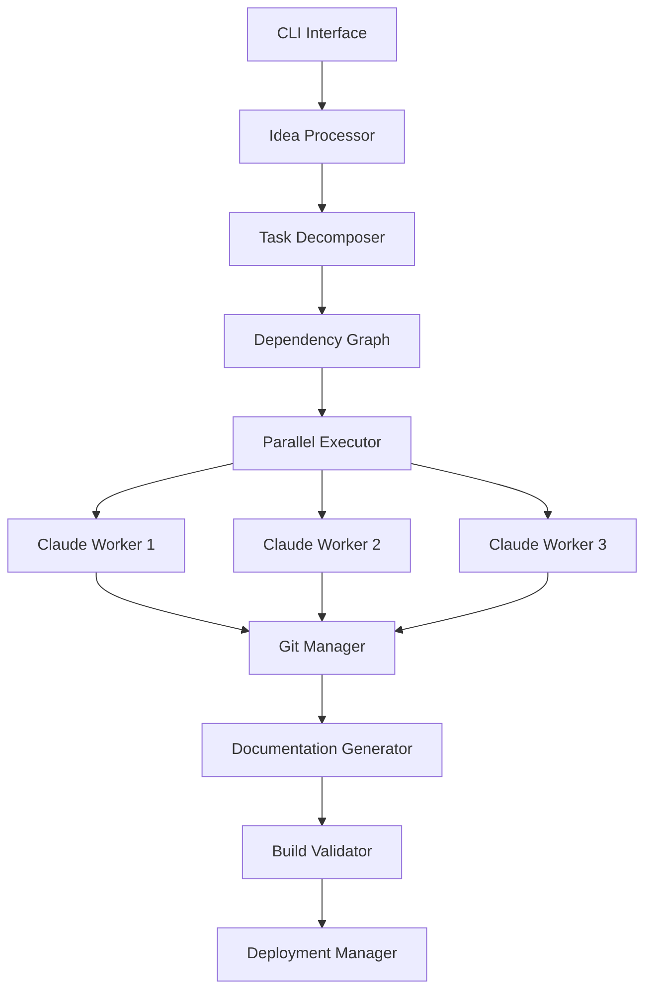
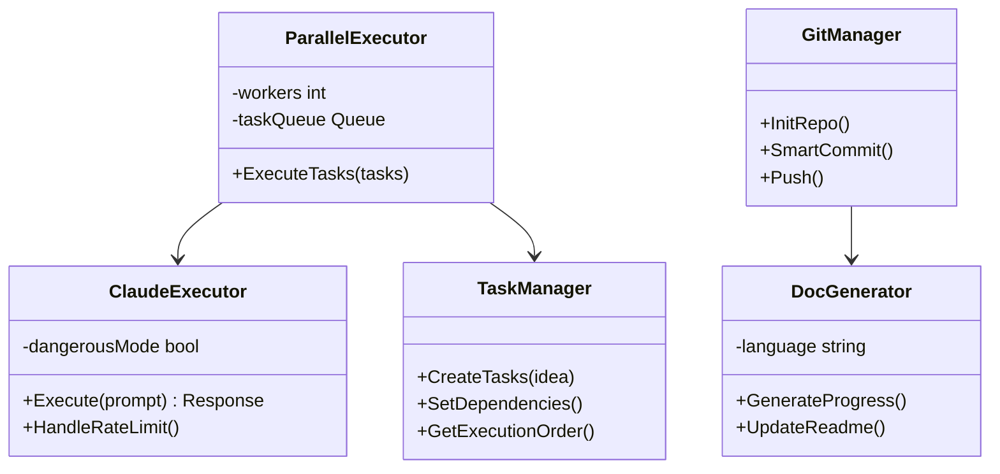
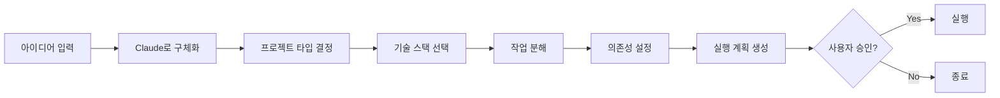
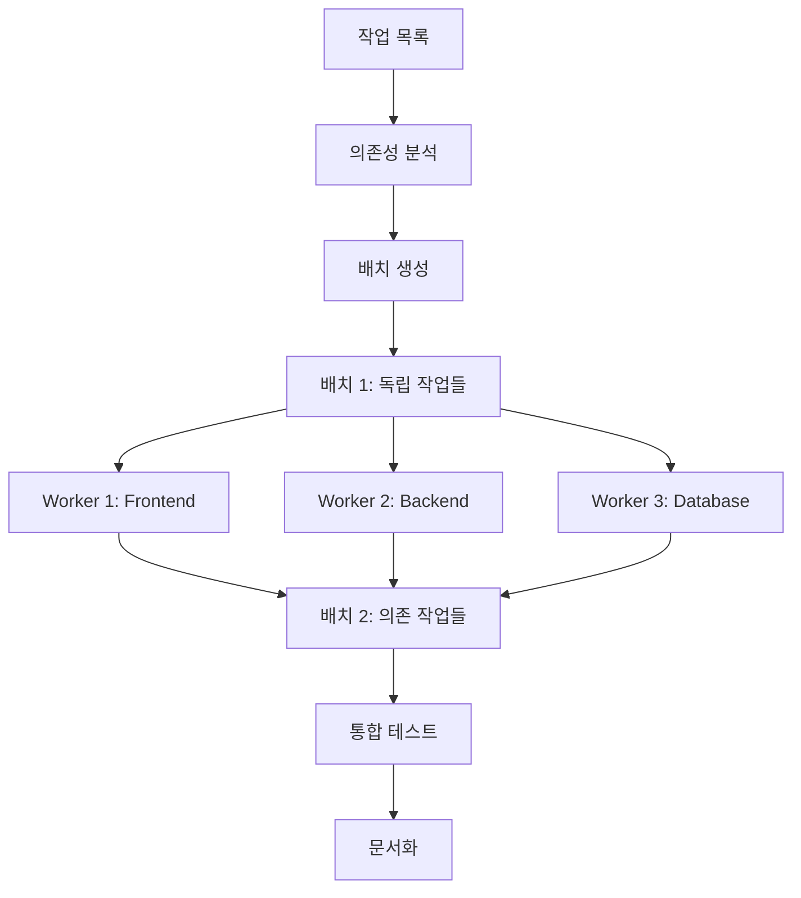
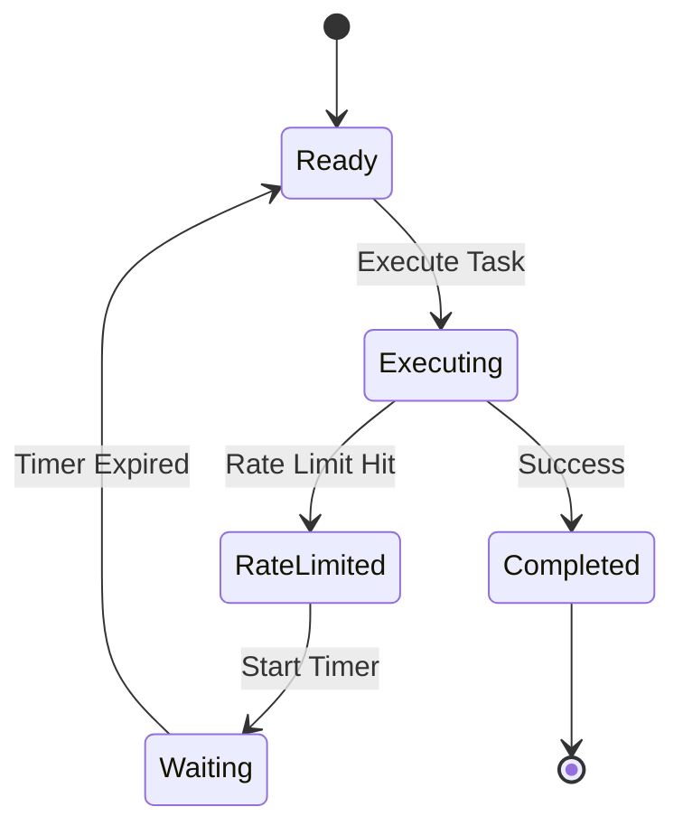

# Claude Auto-Deploy CLI

> 아이디어를 입력하면 자동으로 프로젝트를 생성하고 배포까지 완료하는 AI 기반 자동화 도구

## 📋 목차

- [개요](#개요)
- [핵심 기능](#핵심-기능)
- [아키텍처](#아키텍처)
- [설치 및 설정](#설치-및-설정)
- [사용법](#사용법)
- [프로젝트 구조](#프로젝트-구조)
- [핵심 컴포넌트](#핵심-컴포넌트)
- [워크플로우](#워크플로우)
- [고급 기능](#고급-기능)

## 개요

Claude Auto-Deploy CLI는 사용자의 아이디어를 받아 Claude AI를 활용하여 전체 프로젝트를 자동으로 생성, 개발, 테스트, 배포하는 도구입니다.

### 주요 특징

- 🤖 **AI 기반 자동 개발**: Claude AI를 활용한 지능형 코드 생성
- ⚡ **병렬 처리**: 프론트엔드, 백엔드, 테스트를 동시에 개발
- 📝 **자동 문서화**: 모든 작업 과정을 한글로 상세히 기록
- 🔄 **스마트 Git 관리**: 작은 단위의 의미있는 커밋 자동 생성
- 🚦 **Rate Limit 관리**: API 제한 자동 감지 및 대기
- ✅ **품질 보증**: 자동 테스트, 빌드 검증, 코드 품질 검사
- 🏗️ **클린 아키텍처**: 모범 사례를 따른 깔끔한 코드 구조

## 핵심 기능

### 1. 아이디어 처리 및 구체화

```bash
claude-auto idea "실시간 채팅 애플리케이션"
```

- 아이디어를 구체적인 프로젝트 명세로 변환
- 기술 스택 자동 선택
- 필요한 API 키 식별
- 개발 단계 계획 수립

### 2. 병렬 작업 실행

```go
// 의존성 그래프 기반 병렬 실행
tasks := []Task{
    {Type: "frontend", Priority: 1},
    {Type: "backend", Priority: 1},
    {Type: "database", Priority: 0},
}
executor.ExecuteParallel(tasks)
```

### 3. 자동 Git 관리

- **Atomic Commits**: 기능 단위로 작은 커밋 생성
- **Conventional Commits**: 표준화된 커밋 메시지
- **자동 Push**: 설정 가능한 push 전략

### 4. 실시간 문서화

모든 작업 과정이 `docs/progress/` 디렉토리에 한글로 자동 기록됩니다.

## 아키텍처

### 시스템 아키텍처



### 핵심 컴포넌트 관계



## 설치 및 설정

### 필요 사항

- Go 1.21+
- Claude CLI (`claude` 명령어)
- Git
- GitHub 계정

### 설치

```bash
# 저장소 클론
git clone https://github.com/yourusername/claude-auto.git
cd claude-auto

# 의존성 설치
go mod download

# 빌드
make build

# 또는 직접 설치
go install ./cmd/claude-auto
```

### 환경 설정

```bash
# .env 파일 생성
cp .env.example .env

# 필요한 환경 변수 설정
CLAUDE_API_KEY=your_api_key
GITHUB_TOKEN=your_github_token
```

### 설정 파일 (configs/default.yaml)

```yaml
claude:
  dangerous_mode: true  # --dangerously-skip-permissions 사용
  max_retries: 3
  timeout: 5m

parallel:
  max_workers: 3        # 병렬 워커 수
  task_timeout: 10m

git:
  auto_commit: true
  commit_size: small    # atomic, small, medium
  push_strategy: batch  # immediate, batch, manual

documentation:
  language: ko          # 한글 문서화
  output_dir: ./docs/progress
```

## 사용법

### 기본 사용

```bash
# 아이디어로 프로젝트 생성
claude-auto idea "AI 기반 코드 리뷰 도구 만들기"
```

### 고급 옵션

```bash
# 모든 옵션 활용
claude-auto idea "실시간 협업 편집기" \
  --workers=5 \              # 병렬 워커 수
  --auto-approve \           # 자동 승인 (확인 없이 진행)
  --type=web \              # 프로젝트 타입 지정
  --skip-tests \            # 테스트 생략
  --deploy=vercel \         # 배포 타겟
  --verbose                 # 상세 로그
```

### 명령어 옵션

| 옵션 | 설명 | 기본값 |
|------|------|--------|
| `--workers, -w` | 병렬 워커 수 | 3 |
| `--auto-approve, -y` | 자동 승인 | false |
| `--type, -t` | 프로젝트 타입 (web/api/cli/mobile) | auto |
| `--skip-tests` | 테스트 생성 생략 | false |
| `--deploy, -d` | 배포 타겟 | none |
| `--verbose, -v` | 상세 출력 | false |

## 프로젝트 구조

```
claude-auto/
├── cmd/
│   └── claude-auto/
│       └── main.go              # CLI 진입점
├── internal/
│   ├── core/
│   │   ├── claude_executor.go   # Claude CLI 실행 관리
│   │   ├── rate_limiter.go      # Rate limit 처리
│   │   ├── session_manager.go   # 세션 관리
│   │   └── config.go            # 설정 관리
│   ├── tasks/
│   │   ├── task_manager.go      # 작업 관리
│   │   ├── task_queue.go        # 작업 큐
│   │   ├── parallel_executor.go # 병렬 실행
│   │   └── dependency_graph.go  # 의존성 관리
│   ├── generators/
│   │   ├── idea_processor.go    # 아이디어 처리
│   │   ├── project_generator.go # 프로젝트 생성
│   │   └── code_analyzer.go     # 코드 분석
│   ├── git/
│   │   ├── git_manager.go       # Git 작업
│   │   └── commit_strategy.go   # 커밋 전략
│   ├── docs/
│   │   ├── doc_generator.go     # 문서 생성
│   │   └── progress_tracker.go  # 진행상황 추적
│   └── testing/
│       ├── test_runner.go       # 테스트 실행
│       └── build_validator.go   # 빌드 검증
├── configs/
│   └── default.yaml             # 기본 설정
└── docs/
    └── progress/                # 진행 문서
```

## 핵심 컴포넌트

### 1. Claude Executor

Claude CLI를 실행하고 관리하는 핵심 모듈입니다.

```go
type ClaudeExecutor struct {
    rateLimiter     *RateLimiter
    sessionManager  *SessionManager
    dangerousMode   bool  // --dangerously-skip-permissions
}

func (ce *ClaudeExecutor) Execute(prompt string) (*Response, error) {
    // Rate limit 체크
    if err := ce.rateLimiter.Wait(); err != nil {
        return nil, err
    }

    // Claude 실행
    response := ce.runClaude(prompt)

    // Rate limit 감지 및 처리
    if response.IsRateLimited() {
        ce.handleRateLimit(response)
    }

    return response, nil
}
```

### 2. Task Manager

작업을 분해하고 의존성을 관리합니다.

```go
type Task struct {
    ID           string
    Type         TaskType  // frontend, backend, database, test
    Prompt       string
    Dependencies []string
    Status       TaskStatus
}

func (tm *TaskManager) DecomposeTasks(idea ProcessedIdea) []*Task {
    tasks := []*Task{}

    // 초기 설정
    tasks = append(tasks, tm.createInitTask(idea))

    // 백엔드 작업들
    if idea.HasBackend {
        tasks = append(tasks, tm.createBackendTasks(idea)...)
    }

    // 프론트엔드 작업들
    if idea.HasFrontend {
        tasks = append(tasks, tm.createFrontendTasks(idea)...)
    }

    // 의존성 설정
    tm.setDependencies(tasks)

    return tasks
}
```

### 3. Parallel Executor

병렬로 작업을 실행합니다.

```go
func (pe *ParallelExecutor) ExecuteTasks(tasks []*Task) error {
    // 의존성 그래프 생성
    graph := buildDependencyGraph(tasks)

    // Topological sort로 실행 순서 결정
    batches := topologicalSort(graph)

    // 각 배치를 병렬로 실행
    for _, batch := range batches {
        pe.executeBatch(batch)
    }

    return nil
}
```

### 4. Git Manager

스마트한 Git 관리를 제공합니다.

```go
func (gm *GitManager) SmartCommit(files []string, taskType TaskType) error {
    // 변경사항 분석
    changes := gm.analyzeChanges(files)

    // 커밋 크기에 따라 그룹화
    groups := gm.groupChanges(changes, gm.commitSize)

    // 각 그룹을 커밋
    for _, group := range groups {
        message := gm.generateCommitMessage(group, taskType)
        gm.commit(message)
    }

    return nil
}
```

### 5. Documentation Generator

진행 상황을 한글로 문서화합니다.

```go
func (dg *DocGenerator) GenerateProgressReport(tasks []*TaskResult) error {
    doc := ProgressDocument{
        Date:  time.Now(),
        Phase: dg.determinePhase(tasks),
        Tasks: dg.summarizeTasks(tasks),
    }

    // 마크다운 생성
    markdown := dg.renderMarkdown(doc)

    // 파일 저장
    filename := fmt.Sprintf("progress_%s.md", time.Now().Format("2006-01-02"))
    return dg.saveToFile(filename, markdown)
}
```

## 워크플로우

### 1. 아이디어 처리 플로우



### 2. 병렬 실행 플로우



### 3. Rate Limit 처리 플로우



## 고급 기능

### 1. 의존성 그래프 자동 생성

시스템이 자동으로 작업 간 의존성을 파악하고 최적의 실행 순서를 결정합니다.

### 2. 지능형 Rate Limit 관리

- Exponential backoff 적용
- 자동 재시도
- 대기 시간 예측

### 3. 프로젝트 템플릿

다양한 프로젝트 타입에 대한 템플릿 지원:
- Next.js + TypeScript
- Express + MongoDB
- FastAPI + PostgreSQL
- React Native + Firebase

### 4. 품질 검증 시스템

- ESLint/Prettier 자동 실행
- 단위 테스트 생성 및 실행
- 빌드 검증
- 보안 스캔

### 5. 진행 상황 문서

매 작업마다 다음 정보를 자동 기록:
- 완료된 작업
- 진행 중인 작업
- 발생한 이슈 및 해결 과정
- 프로젝트 메트릭
- 다음 단계

## 실행 예시

### 입력
```bash
claude-auto idea "AI 기반 코드 리뷰 도구"
```

### 출력
```
✨ Processing idea...

📋 Project Plan Generated:
  Type: Full-stack Web Application
  Frontend: Next.js 14 + TypeScript + Tailwind CSS
  Backend: Node.js + Express + OpenAI API
  Database: PostgreSQL + Redis

📊 Tasks Breakdown:
  - 15 Frontend tasks
  - 12 Backend tasks
  - 8 Database tasks
  - 10 Testing tasks
  - 5 Documentation tasks

🔑 Required API Keys:
  - OPENAI_API_KEY (Required)
  - GITHUB_TOKEN (Required)
  - DATABASE_URL (Auto-generated)

Proceed with generation? (y/n): y

🚀 Starting parallel execution...

[Worker 1] ✅ Project initialization complete
[Worker 2] ✅ Database schema created
[Worker 3] ✅ API endpoints implemented
[Worker 1] ✅ Frontend components created
[Worker 2] ✅ Authentication system implemented
[Worker 3] ✅ Code review logic implemented

⏳ Rate limited. Waiting 60s...

[Worker 1] ✅ UI styling completed
[Worker 2] ✅ WebSocket integration done
[Worker 3] ✅ Testing suite created

📈 Progress: ████████████████████ 100%

✅ Project generated successfully!

📁 Location: ./ai-code-review-tool
🌐 Repository: https://github.com/user/ai-code-review-tool
📖 Documentation: ./docs/progress/
🚀 Deploy command: npm run deploy

Summary:
  - Total commits: 47
  - Lines of code: 12,847
  - Test coverage: 78%
  - Build time: 2m 34s
  - Total time: 18m 42s
```

## 진행 문서 예시

`docs/progress/2024-01-15_progress.md`:

```markdown
# 프로젝트 진행 상황 보고서

## 📅 날짜: 2024-01-15 14:30

## 📊 현재 단계: 백엔드 개발

## ✅ 완료된 작업

### Frontend
- **컴포넌트 구조 설계**: 재사용 가능한 컴포넌트 아키텍처 구현
  - 소요 시간: 15분
  - 결과: 12개의 기본 컴포넌트 생성

### Backend
- **API 엔드포인트 구현**: RESTful API 설계 및 구현
  - 소요 시간: 25분
  - 결과: 8개의 엔드포인트 완성

## 🔄 진행 중인 작업
- **데이터베이스 스키마 설계**: PostgreSQL 테이블 구조 설계 중
  - 시작 시간: 14:25
  - 예상 완료: 14:35

## 📈 프로젝트 메트릭
- 전체 진행률: 65%
- 코드 라인 수: 8,234
- 테스트 커버리지: 72%
- 빌드 성공률: 100%

## 🔑 필요한 API 키
- **OpenAI API**: ✅ 설정됨
- **GitHub Token**: ✅ 설정됨
- **SendGrid API**: ❌ 필요 (이메일 전송용)

## 🚀 다음 단계
1. WebSocket 실시간 통신 구현
2. 사용자 인증 시스템 완성
3. 프론트엔드-백엔드 통합 테스트

## ⚠️ 이슈 및 해결 과정

### Rate Limit 도달
- 발생 시간: 14:15
- 심각도: 중간
- 해결 상태: 완료
- 해결 방법: 60초 대기 후 자동 재시도로 성공
```

## 트러블슈팅

### Rate Limit 문제
```bash
# Rate limit 대기 시간 늘리기
claude-auto idea "..." --rate-limit-wait=120
```

### 병렬 실행 이슈
```bash
# 워커 수 줄이기
claude-auto idea "..." --workers=1
```

### 메모리 부족
```bash
# 배치 크기 조정
claude-auto idea "..." --batch-size=small
```